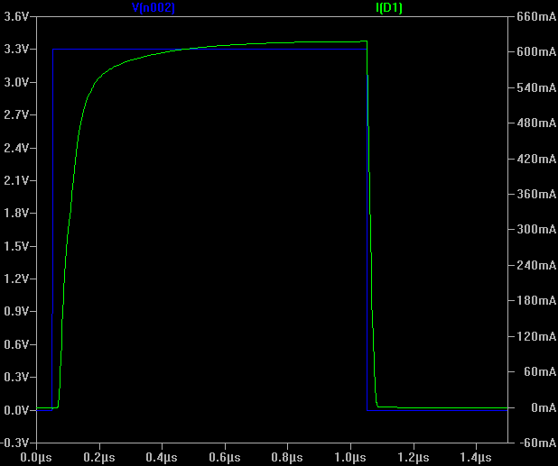
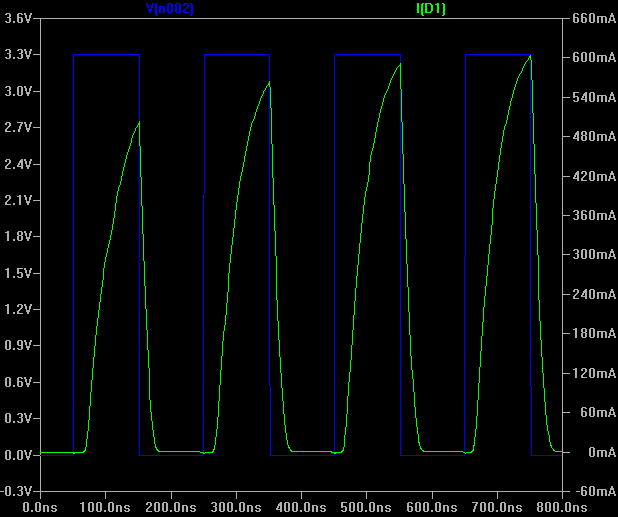
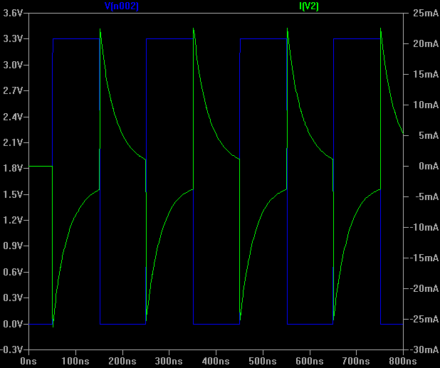

TeensyLED Controller
====================
Copyright Brian Neltner 2015 
Version 0.3 - April 21, 2015

Summary
-------
This provides a basic library and example code for interacting
with a RGBW LED light using Hue, Saturation, and Intensity (HSI)
mode. This version has been updated to match the pinout of the RGBW
driver board provided in the associated Eagle Design files included
in this repository.

Software Features
-----------------
- HSI to RGBW library for interacting with LED sources with color correction.
- PID based fader that follows a random walk through colorspace.
- Outline (totally untested) start of DMX receiving software.

For more information about the HSI Colorspace developed by SaikoLED
please check out:
- [Why every LED light should be using HSI colorspace.](http://blog.saikoled.com/post/43693602826/why-every-led-light-should-be-using-hsi)
- [How to convert from HSI to RGB+white.](http://blog.saikoled.com/post/44677718712/how-to-convert-from-hsi-to-rgb-white)
- [Implementing arbitrary color correction with the myki!](http://blog.saikoled.com/post/45630908157/implementing-arbitrary-color-correction-with-the)
- [Talk about HSI Colorspace and RGBW](http://blog.saikoled.com/post/71708131057/talk-about-hsi-colorspace-and-rgbw)

If you are curious about our other projects, you can visit our [blog](http://blog.saikoled.com).

Hardware Features
-----------------
Targeted features in this Eagle Board design, which is also released
as open hardware under the same license as this software.

- Teensy 3.1 socket.
- RJ45-based DMX Connectors as per DMX-512A.
- Fully isolated DMX-compatible RS485 Interface (ADM2582E).
- Header to switch polarity of DMX signal for compatibility.
- Accessible slider switch for connecting 120 ohm termination resistor.
- 4x 700mA BJT based current sinks (670-730mA typical).
- Current sinks capable of driving 700mA with 100ns rise time, with significant current driven in a shorter time.
- 100nm pulse width allows 16-bit PWM at 150Hz, or 8-bit PWM at 39kHz. 16-bit PWM possible at 300Hz, or 8-bit PWM at 78kHz, with minor nonlinearity for PWM values of 1. See Simulations directory for more detail on theoretical performance.
- 5-24VDC board compatibility, with the Vin routed directly to LED V+. Up to 5A allowed by CP-202AH-ND barrel plug connector. Voltage limit is due to barrel plug connector, up to 48VDC can be wired directly using the available test point.
- Built in high efficiency switching regulator to provide 3.7VDC.
- Designed to fit into Hammond 1455C801 Extruded Aluminum Enclosure.
- Solder lugs compatible with Keystone 5016 test points for:
  - V+ (voltage to the board)
  - GNDA (ground to the board)
  - VCC (voltage from 3.7V supply)
  - GND (ground for digital ICs)
  - VISO (isolated 3.3V for DMX)
  - GISO (isolated DMX ground)
  - DAC (12-bit Teensy 3.1 DAC output)
  - A0-A1 (2x 10-bit ADCs)
  - A2-A3 (2x 10-bit ADC also usable for capacitive touch sensors)
  - MISO/MOSI/SCK/CS for SPI
- Separate ground pours were used for the power ground, digital ground,
and DMX ground.

Hardware Performance
--------------------
Simulations have been done on the current sinking circuitry in order to optimize the response time and stability, but tests on real hardware have not yet been done. Simulations were done using LTSpice and the vendor supplied model for the ZXT1053AK. These simulations are limited in predicting real performance, particularly in the realm of thermal issues.

###Circuit Model

###Current Output with 1μs pulse.

###Current Output with 100ns pulse.

###Estimated current load from controller pin.

Major Hardware Limitations
--------------------------
- Heat dissipation at the BJTs is severe, with switching regulators
generally being inappropriate for such high speed PWM capabilities.
  - Although the BJTs chosen are rated to 4.4W each, at 700mA and a
    typical minimum drop from the top of the BJT to ground of 3V for
    good regulation, power dissipation throughout the board is likely
    to be a bare minimum of 2.1W per channel fully on.
  - I think that if you operate the system in HSI mode, where the
    total current sent to the LEDs is limited to 700mA, split between
    the various channels to change colors, you can probably get away
    with as much as 4W from that subsystem. This is power lost in the
    current sink itself, the power of the LEDs is unimportant.
  - This limits the voltage you can have between the *bottom* of your
    LED chain (no matter how long it is) and ground to under *5VDC*.
  - I am thinking about a new design that will automatically regulate
    down the voltage at the top of the LEDs to the minimum needed
    for reliable regulation based on feedback, but this is a work in
    progress. Perhaps for version 2.0.
- High current and high frequency PWM may radiate excessively for FCC.
- High current and frequency PWM may introduce noise issues into board.
  - May severely degrade ADC measurements, especially from high-
    impedance sources.
  - May disrupt RS485 communication, this could render the board
    non-functional. As yet untested.
  - May put enough noise onto the power supply so as to severly
    hinder normal operation.
- No protection diode for reverse voltage protection at V+!
- No inductor to reduce radiation onto input power.
- The best design practices I know for managing these I have used, but
I am not an EE, I only play one on TV sometimes.

License
-------
All software, hardware designs, and hardware design files are licensed
under the GPL.

> TeensyLED Controller is free software and hardware: you can redistribute
> it and/or modify it under the terms of the GNU General Public License
> as published by the Free Software Foundation, either version 3 of the\
> License, or (at your option) any later version.
> 
> TeensyLED Controller is distributed in the hope that it will be useful,
> but WITHOUT ANY WARRANTY; without even the implied warranty of
> MERCHANTABILITY or FITNESS FOR A PARTICULAR PURPOSE.  See the
> GNU General Public License for more details.
> 
> You should have received a copy of the GNU General Public License
> along with Foobar.  If not, see <http://www.gnu.org/licenses/>.
